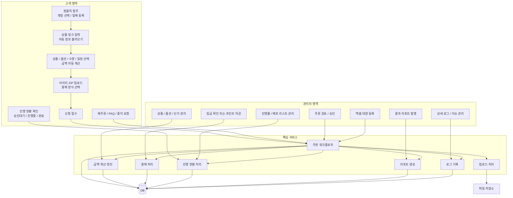
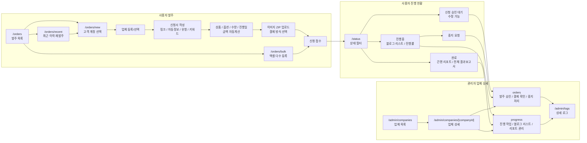
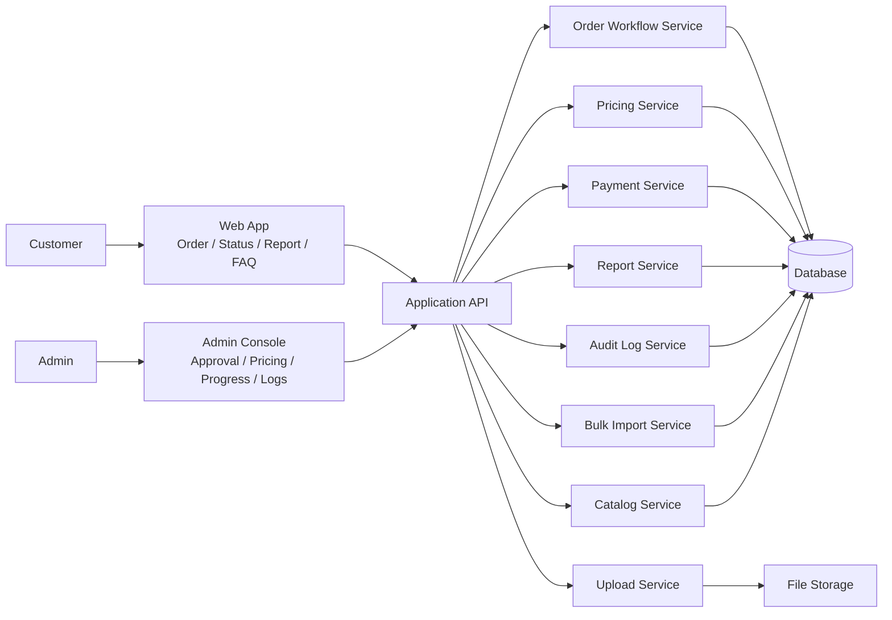
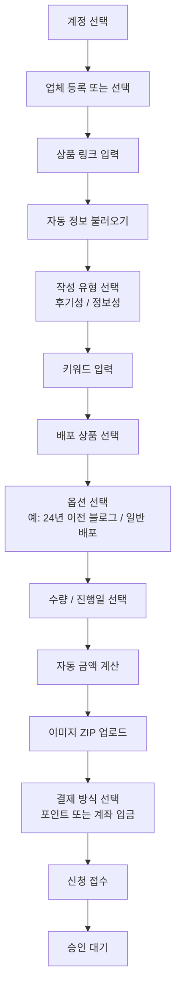
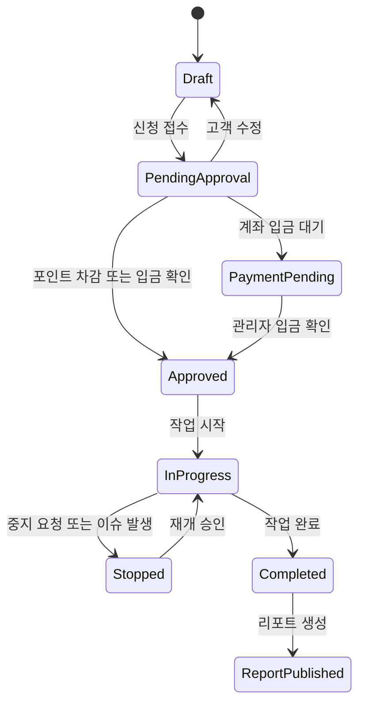
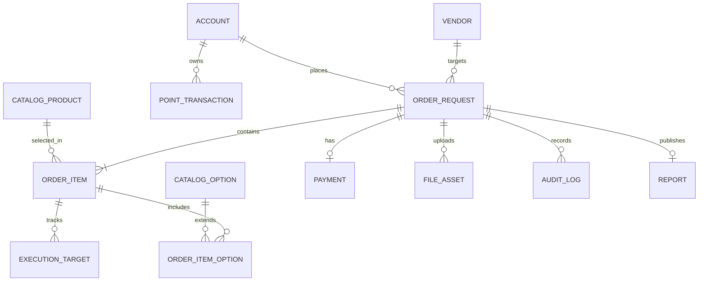
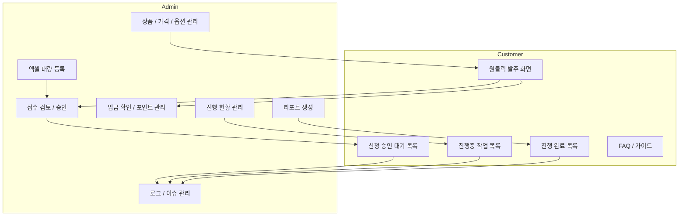

# Order Workflow Architecture

Related plan:
- [2026-04-26-order-workflow-foundation](../exec-plans/active/2026-04-26-order-workflow-foundation.md)

## Problem Statement

The requested platform needs to support a much smoother customer ordering experience while giving admins clear control over approval, payment confirmation, execution tracking, issue handling, and reporting.

If these concerns are not separated early, the system will quickly become difficult to maintain because pricing rules, workflow state, uploads, and reporting all change at different speeds.

## Decision Summary

- use a staged order intake flow that saves a structured request rather than one large free-form form
- isolate automatic amount calculation in a dedicated pricing service
- model each request as a parent order with one or more child execution items
- separate customer-visible request status from internal execution progress details
- keep approval, payment verification, logs, and reporting as explicit modules instead of embedding them into the form layer
- treat bulk Excel import and one-click re-order as alternate intake channels that still feed the same core order workflow

## One-Glance Architecture

## Requirement-Based UI Flow

## System Overview

## Customer Flow

## Core State Model

### Customer-visible request states

- `pending_approval`: 신청 접수 후 관리자 승인 전, 고객 수정 가능
- `in_progress`: 승인 완료 후 실제 배포 진행 중
- `completed`: 결과 리포트 확인 가능
- `stopped`: 이슈로 중지 요청되었거나 관리자 보류 상태

### Supporting states

- `draft`: 작성 중이지만 아직 제출 전
- `payment_pending`: 계좌 입금 대기 또는 포인트 부족 등 결제 완료 전
- `approved`: 관리자가 승인했고 실행 대기 또는 실행 시작 직전
- `report_published`: 완료 후 결과 보고서 공개됨

## State Transition Diagram

## Module Responsibilities

### 1. Catalog Service

- 배포 상품, 옵션, 기본 단가 관리
- 상품별 설명과 부가세 제외 기준 금액 보관
- 특정 계정 또는 업체에 대한 판매 가능 여부 판단

### 2. Pricing Service

- 상품 선택, 옵션 선택, 수량, 일정 기준으로 금액 계산
- 세전 금액 기준 계산 결과와 표시용 합계 반환
- 계산식 변경 이력 저장 가능하도록 버전 관리 고려

### 3. Order Workflow Service

- 접수서 생성, 수정, 제출, 승인 잠금 처리
- 상위 주문과 하위 실행 항목 연결
- 상태 필터 기준 데이터 제공

### 4. Payment Service

- 포인트 차감형 처리
- 건별 입금 대기 및 관리자 입금 확인 처리
- 승인 전 결제 충족 여부 판단

### 5. Upload Service

- 이미지 ZIP 업로드, 검증, 저장
- 주문과 파일 연결
- 관리자 확인용 메타데이터 보관

### 6. Execution Tracking Service

- 진행률 계산
- 진행 블로그 리스트 연결
- 진행 건수 / 총 신청 건수 집계

### 7. Report Service

- 완료 건에 대한 간편 리포트 생성
- 전체 결과 보고서 조회용 데이터 조합

### 8. Audit Log Service

- 수정 이력
- 승인/반려/입금 확인 이력
- 중지 요청 및 재개 이력
- 엑셀 대량 등록 결과 이력

## Suggested Data Model

## Screen-Level View

## Key Flows

### Approval and edit lock

- 고객은 `pending_approval` 상태까지만 접수서를 수정할 수 있다.
- 관리자가 승인하면 고객 편집은 잠기고, 이후 변경은 별도 수정 요청 또는 관리자 조정으로 처리한다.

### Progress display

- 진행중 화면에는 주문 단위 상태와 하위 실행 대상 리스트를 함께 보여준다.
- 진행률은 `완료 실행 건수 / 전체 실행 건수` 기반 계산이 가장 일관적이다.

### Re-order

- 최근 계정 작업 이력을 불러와 새 주문 초안으로 복제한다.
- 가격은 과거 값을 복제하지 말고 현재 가격 규칙으로 다시 계산한다.

### Bulk Excel import

- 엑셀은 개별 주문 행을 임시 검증한 뒤 일괄 생성한다.
- 부분 실패를 허용하되, 실패 사유를 행 단위로 반환해야 한다.

## Open Questions And Follow-Ups

- 자동 정보 불러오기 범위는 어디까지인가: 제목, 업체명, 상품명, 카테고리, 썸네일?
- 블로그 배포 결과 리스트는 외부 URL만 저장할지, 추가 메타데이터도 저장할지?
- 포인트 차감 시점은 승인 시점인지, 접수 시 예약 차감인지?
- 간편 리포트와 전체 결과 보고서의 차이를 어떤 수준으로 둘지?
- 중지 요청은 고객 단독 즉시 중지인지, 관리자 승인 기반인지?
